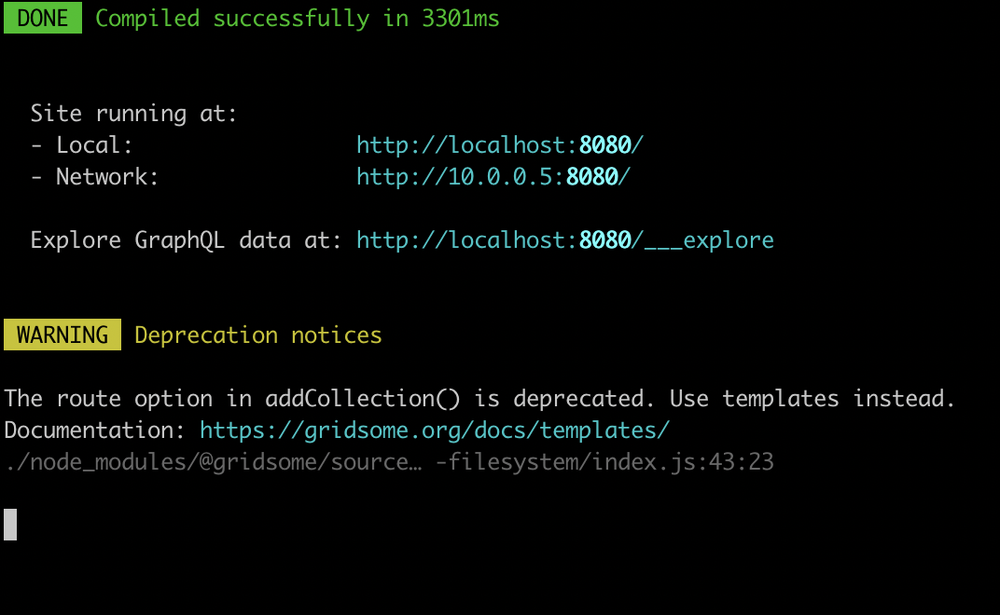
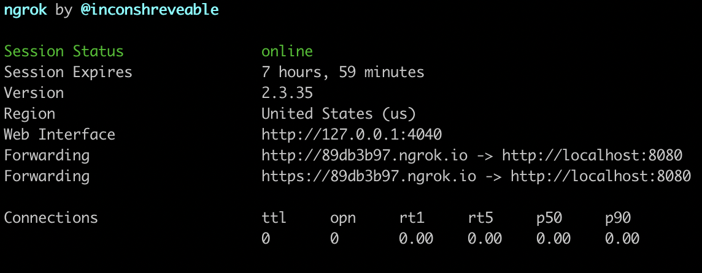

Use a localhost server ****- A way to share your localhost and test on other devices 

[ngrok - secure introspectable tunnels to localhost](https://ngrok.com/)

I'm using this one

If port `8080` is in use

Then  run  `./ngrok http 8080`

Use Forwarding https link  and share